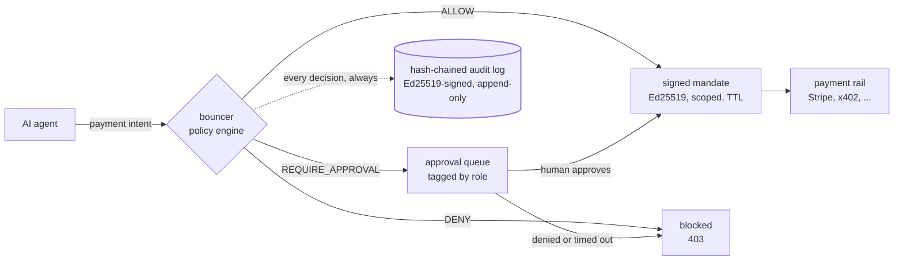
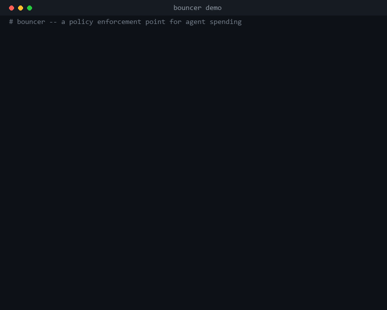

# bouncer

**A policy enforcement point for agent spending.**

[](https://github.com/nmaltese13/bouncer/actions/workflows/ci.yml)
[](#development)
[](https://www.python.org/downloads/)
[](LICENSE)
[](http://mypy-lang.org/)

bouncer sits between an AI agent and any payment rail, blocks transactions that
violate a declarative policy, and writes a tamper-evident, signed audit log of
every decision.



Every path through that diagram ends in an audit entry — including the ones
that fail. A denial, an unparseable request and an approval that timed out are
all *logged* outcomes, never silent pass-throughs.

## See it work



Every line in that recording is real CLI output, captured by
[`scripts/record_demo.py`](scripts/record_demo.py).

## Trust boundary

Read this before deciding bouncer is a control you can rely on.

**bouncer is the policy *decision* point. Your network is the *enforcement*
point.** Three limits follow, and none of them are bugs:

- **It never custodies funds.** bouncer emits a signed authorization; something
  else settles the payment. It cannot freeze, claw back or reverse anything.
  This is deliberate — holding money means needing a money transmitter licence.
- **It cannot stop an agent that bypasses it.** An agent with unrestricted
  network egress can ignore the proxy and connect directly. Real containment
  requires firewall or container rules that make bouncer the only route out.
- **It does not replace your payment provider's controls.** Keep your card
  limits, processor-side fraud rules and provider spending caps configured
  independently. bouncer is a layer in front of them, not a substitute.

Nothing here has been security audited. See [SECURITY.md](SECURITY.md) and the
full [threat model](#threat-model) below.

---

## Quickstart

Copy and paste the whole block. Every line runs as written, against the starter
policy `bouncer init` generates — no editing required to see it work.

```bash
git clone https://github.com/nmaltese13/bouncer.git
cd bouncer
python -m venv .venv
. .venv/bin/activate          # Windows: .venv\Scripts\activate
pip install -e .

bouncer init                  # operator key + starter policy in ~/.bouncer
bouncer policy                # show exactly what will be enforced

# Allowed: inside the cap and on the allowlist
bouncer check --agent research-bot --merchant api.openai.com --amount 5.00

# Blocked: over the 25.00 per-transaction cap
bouncer check --agent research-bot --merchant api.openai.com --amount 500.00

# Blocked: merchant is on the denylist
bouncer check --agent research-bot --merchant lucky.casino.example --amount 1.00

# Needs a human: above the 10.00 approval threshold
bouncer check --agent research-bot --merchant api.openai.com --amount 15.00
bouncer pending --role finance

# Every decision above, hash-chained and signed
bouncer verify
```

`bouncer check` exits `0` when the payment is allowed, `2` when it is not —
denied *or* held for a human — and `3` when the audit chain is broken, so it
drops straight into a shell pipeline.

From there, edit `~/.bouncer/policy.yaml` to write your own rules, and run
`bouncer serve` to expose the same decisions as a local API on `:8080`. With the
server up, `http://127.0.0.1:8080/docs` is a full interactive console for
`POST /authorize` — the quickest way to show someone the enforcement working.

Two runnable examples, both using throwaway state so your real `~/.bouncer` is
never touched:

```bash
python examples/agent.py   # a toy agent with a $50 budget, spending until it is stopped
python examples/demo.py    # six purchases, ending with the audit chain caught being tampered with
```

---

## Threat model

Build to this. This section is the contract; nothing else in these docs claims
more than it does.

**bouncer guarantees:**

- An agent whose traffic reaches bouncer cannot obtain a valid mandate for a
  transaction the policy denies.
- Every decision is logged. Tampering with the log after the fact is detectable
  via the hash chain and operator signature.
- Mandates are scoped to one merchant and amount, expire, and cannot be
  replayed.

**bouncer does NOT guarantee:**

- **It is not a sandbox.** An agent with unrestricted network egress can ignore
  the proxy entirely. Actual containment requires egress control at the
  network or container layer — firewall rules that make bouncer the only route
  out. bouncer is the policy decision point; the network is the enforcement
  point.
- **CLI roles are not authenticated.** `--role finance` is an assertion by
  whoever has shell access, not a login. v1 assumes a single trusted operator
  on a trusted machine. Anyone who can run the CLI can approve anything.
- The operator signing key proves the log was not altered _after_ writing. It
  proves nothing about a compromised operator at write time.
- Nothing here has been security audited.

### Three limits the implementation adds

Building v1 surfaced three more boundaries. They narrow the claims above; they
never widen them.

**Tail truncation is not detectable from the log alone.** The hash chain catches
edits, insertions, and deletions from the middle. An attacker who deletes the
most recent N rows leaves a chain that is internally perfect. `bouncer verify`
prints the head hash — record it somewhere bouncer cannot reach, and pass it
back to close the gap:

```bash
bouncer verify --expect-head 6b38557b4efae22e...
```

**CONNECT tunnels cannot be policed, so they are denied by default.** Inside a
TLS tunnel bouncer sees a hostname and nothing else — no amount, no category, no
intent. Caps, rolling windows and approval thresholds cannot apply. Running the
proxy with `--allow-connect` permits tunnels to *explicitly allowlisted* hosts
only, and the traffic inside them is **unenforced**. Full enforcement of HTTPS
payment traffic needs TLS termination, which v1 does not do (see
[ROADMAP.md](ROADMAP.md)).

**The API authenticates nobody.** The `agent_id` in a request is an assertion by
the caller. An agent that can reach `/authorize` can claim to be any agent in
the policy. Bind to loopback and treat network reachability as the boundary.

**x402 over the proxy is not fully enforceable.** The adapter reads a 402
challenge, which is a *response*. An agent's follow-up payment carries an
`X-PAYMENT` header whose payload names an amount in atomic units but no asset
decimals, so its true value cannot be determined without an off-chain lookup the
engine is not allowed to make. bouncer denies what it cannot price. Send x402
intents to `/authorize` explicitly, where the challenge supplies the scale.

---

## What this is not

- **Not custody.** bouncer never holds, moves, or touches funds. It emits a
  signed authorization; something else settles the payment. This is deliberate:
  the moment it holds money it needs a money transmitter licence.
- **Not a standard.** The agent-payment standards war (ACP, MPP, UCP, AP2, x402,
  Visa TAP) is unsettled. bouncer is invariant to which one wins — it is an
  adapter plus a policy layer, not a fifth protocol.
- **Not a sandbox.** See the threat model. Without egress control, an agent can
  route around it.
- **Not audited.** No security review has been performed. The Stripe adapter
  refuses live-mode keys for exactly this reason.
- **Not multi-tenant.** One operator, one machine, one local process. No auth,
  no billing, no dashboard.

---

## Writing a policy

Everything is deny-by-default. An agent that is not named cannot spend at all.

```yaml
version: 1
currency: USD

agents:
  research-bot:
    per_transaction_cap: 50.00

    rolling_windows:
      - amount: 100.00
        window: 30d

    merchants:
      allow: ["api.weather.example", "*.trusted-vendor.example"]
      deny: ["*.casino.example"]

    categories:
      deny: ["gambling"]

    time_windows:
      - days: [mon, tue, wed, thu, fri]
        start: "09:00"
        end: "18:00"
        timezone: "America/New_York"

    approval_required_above:
      amount: 20.00
      approver_role: finance
```

The choices behind the schema, all of which fail closed:

| Rule | Behavior |
| --- | --- |
| Unknown agent | Denied. `"*"` is a valid catch-all key, but you must write it. |
| Misspelled rule name | Load error. It never reads as a missing restriction. |
| `per_transaction_cap` | Mandatory. There is no unlimited rule set. |
| Denylist vs allowlist | Denylist always wins. |
| Missing allowlist | Not a constraint; any merchant not denied passes. |
| Empty allowlist (`[]`) | Nothing passes. A usable way to freeze an agent. |
| Uncategorized request | Denied whenever `categories.allow` is set. |
| Currency mismatch | Denied. bouncer never converts — that needs a live rate. |
| Amounts in YAML | Parsed as decimals, never binary floats. `100.10` is exact. |
| Approval threshold ≥ cap | Load error. It could never fire, so it is a typo. |
| Empty or malformed policy | Denies everything. |

Prohibitions are evaluated **before** the approval threshold, so a forbidden
transaction is never offered to a human. Approvers exercise judgment inside
policy, not over it.

---

## Using it

Three ways in, listed in the order you should reach for them.

### As a library — start here

Guard the spend where your agent makes it. One call to build the client, and a
context manager around the payment:

```python
from bouncer import Client, SpendDenied

client = Client.from_policy(POLICY_YAML, agent_id="research-bot")

try:
    with client.spend(merchant="api.weather.example", amount="12.00") as ok:
        charge_the_card(mandate=ok.mandate)   # only runs if bouncer allowed it
except SpendDenied as refused:
    log.warning("blocked: %s", refused.decision.reason)
```

**A denial raises, and the guarded block never runs.** That is the whole reason
this is a context manager rather than a function returning a verdict — a
returned decision can be ignored by forgetting to check it, and an ignored
denial is an unenforced policy.

`from_policy` takes YAML source, a `Path` to a policy file (watched, so edits
apply without a restart), or a `Policy` object. It creates the operator key on
first use and keeps the audit log in `state_dir`, defaulting to `~/.bouncer`.

Pass `wait=True` to block until a human resolves an approval; **the wait times
out into a deny.** Agents on an event loop use `async with client.aspend(...)`.

See [`examples/agent.py`](examples/agent.py) for a runnable agent that spends
until its budget stops it.

### As a local API

For agents that aren't Python. Run `bouncer serve`, then:

```bash
curl -X POST localhost:8080/authorize \
  -H 'content-type: application/json' \
  -d '{"agent_id":"research-bot","merchant":"api.weather.example","amount":"12.00","currency":"USD"}'
```

`200` allowed (with a mandate), `403` denied, `202` awaiting a human. Add
`?wait=true` to long-poll for an approval; **the wait times out into a deny.**
`http://127.0.0.1:8080/docs` is an interactive console for the same endpoints.

### As a proxy — plaintext HTTP only

```bash
bouncer proxy --port 8081
export HTTP_PROXY=http://127.0.0.1:8081
```

Plaintext HTTP is parsed, judged, and either forwarded or blocked with a 403.
An authorized request is forwarded with an `X-Bouncer-Mandate` header the
upstream service can verify. Traffic no adapter can parse is denied and logged —
never forwarded unexamined.

**Know the limit before relying on this.** bouncer cannot see inside TLS, so
CONNECT tunnels are denied by default and unenforced when you allow them. Since
real payment APIs are HTTPS, the proxy does *not* police them today — that needs
TLS termination, which this version does not do. Use the library or the API for
enforcement you can count on.

Spend counts against rolling windows at *authorization* time, not settlement, so
an authorized payment you then abandon still consumes budget. That is the
conservative direction: under-counting would let a retry loop outspend its
ceiling.

To evaluate without any I/O at all, call the pure engine directly:

```python
from datetime import datetime, timezone
from bouncer import LocalFileSource, PaymentIntent, evaluate

decision = evaluate(
    PaymentIntent(agent_id="research-bot", merchant="api.weather.example",
                  amount="12.00", currency="USD"),
    LocalFileSource("policy.yaml").load(),
    spend_history,
    now=datetime.now(timezone.utc),
)
```

`evaluate` is pure: no network, no disk, no clock reads, no model calls. The
same inputs always produce the same decision.

---

## The audit log

Every decision is one hash-chained, Ed25519-signed SQLite row.

```bash
bouncer verify                  # walk the chain, name the first broken row
bouncer export -o audit.jsonl   # line-delimited JSON for SIEM ingestion
```

Export is a first-class library function, not a script:

```python
from bouncer.audit import AuditLog, export_jsonl, verify_exported
export_jsonl(log, "audit.jsonl")
```

An exported file re-verifies standalone from the operator's **public** key, so
an auditor can check a log you hand them without database access or your
signing key.

Spent mandate nonces accumulate in the same database. `bouncer purge` drops the
ones whose mandates have expired — safe by construction, since an expired
mandate is already rejected on the expiry check. It never touches the
append-only audit log. Run it from cron if you are issuing a lot of mandates.

---

## Approvals

```bash
bouncer pending --role finance
bouncer approve <id> --role finance
bouncer deny    <id> --role finance
```

Approve and deny run the identical role check — there is no asymmetric
authority where vetoing is easier than approving. Resolution is once-only.
Set `BOUNCER_WEBHOOK_URL` to get a POST when something lands in the queue; a
webhook failure never changes an outcome.

**The role check is a workflow guardrail, not a security control.** See the
threat model.

---

## Adding a payment rail

Write one file in `bouncer/adapters/` that turns the rail's traffic into a
`PaymentIntent`, and add it to `DEFAULT_ADAPTERS`. Nothing else changes.

Shipped: `x402` (HTTP 402 challenges), `stripe` (PaymentIntent creates, **test
mode only**), `generic` (explicit JSON).

Adapters never decide anything — they extract fields and hand them to the
engine. An adapter that cannot confidently parse a request raises, and that
becomes a logged deny. Refusing beats guessing: the x402 adapter will not
assume an unknown asset's decimal scale, because guessing wrong is a
factor-of-a-million error.

---

## Development

```bash
uv venv --python 3.12 && uv pip install -e ".[dev]"
.venv/bin/python -m pytest          # 245 tests, ~10s
.venv/bin/python -m mypy            # strict, clean
```

On Windows the interpreter is `.venv\Scripts\python.exe`, and one test skips:
key file permissions are POSIX mode bits, which Windows does not honour. The
key is left under the inherited directory ACL there — see the note in
`bouncer/keys.py`.

Standards: type hints everywhere, `mypy --strict` clean, no `TODO` in committed
code (it goes in [ROADMAP.md](ROADMAP.md)), tests under 10 seconds, and a
docstring stating the threat model on every security-relevant function.

## License

MIT — see [LICENSE](LICENSE).
